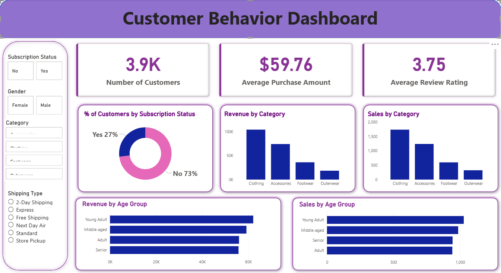

# Customer Shopping Behavior Analysis (Python | SQL | Power BI)

## 📊 Project Overview
This project analyzes customer shopping behavior data to uncover valuable insights about purchasing patterns, customer preferences, and business performance metrics. The analysis helps businesses understand their customer base better and make data-driven decisions to improve marketing strategies, customer retention, and revenue optimization.

## 🎯 Live Dashboard Features
The interactive dashboard provides real-time insights into customer shopping patterns with the following key visualizations:

### 📈 Key Metrics Display
- **Total Revenue** analysis with gender segmentation
- **Average Purchase Amount** comparisons across customer segments
- **Customer Distribution** across loyalty tiers (New, Returning, Loyal)
- **Top Performing Products** by category and rating

### 🔍 Interactive Visualizations
- **Revenue by Gender** - Pie chart showing male vs female spending patterns
- **Subscription Performance** - Comparative analysis of subscriber vs non-subscriber metrics
- **Product Ratings** - Display of top 5 highest-rated products
- **Customer Segmentation** - Visual breakdown of loyalty tier distribution
- **Shipping Analysis** - Average spend comparison across shipping methods
- **Discount Performance** - Products with highest discount adoption rates

## 📁 Dataset Description
The dataset contains **1,377 customer records** with comprehensive attributes including:

- **Customer Demographics**: Age, Gender, Location
- **Purchase Details**: Item purchased, Category, Purchase amount (USD)
- **Product Information**: Size, Color, Season
- **Customer Experience**: Review rating, Previous purchases
- **Business Operations**: Shipping type, Discount applied, Promo code usage
- **Customer Relationship**: Subscription status, Payment method, Purchase frequency

## 🛠️ Technical Stack

### Backend & Analysis
- **Python** - Data processing and analysis
- **SQL** - Database queries and data extraction
- **Pandas** - Data manipulation and transformation
- **NumPy** - Numerical computations

### Visualization & Dashboard
- **Power BI** - Interactive dashboard creation

### Database
- **PostgreSQL** - Data storage and management

## 🎯 Business Problems Solved

### 1. **Customer Segmentation & Targeting**
- Identifies New, Returning, and Loyal customer segments
- Enables personalized marketing campaigns
- Facilitates customer lifetime value prediction

### 2. **Revenue Optimization**
- Reveals highest revenue-generating customer segments
- Identifies products with best discount performance
- Compares subscription vs non-subscription revenue impact

### 3. **Product Strategy**
- Highlights top-rated products for quality assurance
- Shows category performance for inventory planning
- Identifies discount-sensitive products for promotions

### 4. **Operational Efficiency**
- Evaluates shipping method cost-effectiveness
- Analyzes subscription program ROI
- Measures discount strategy effectiveness

